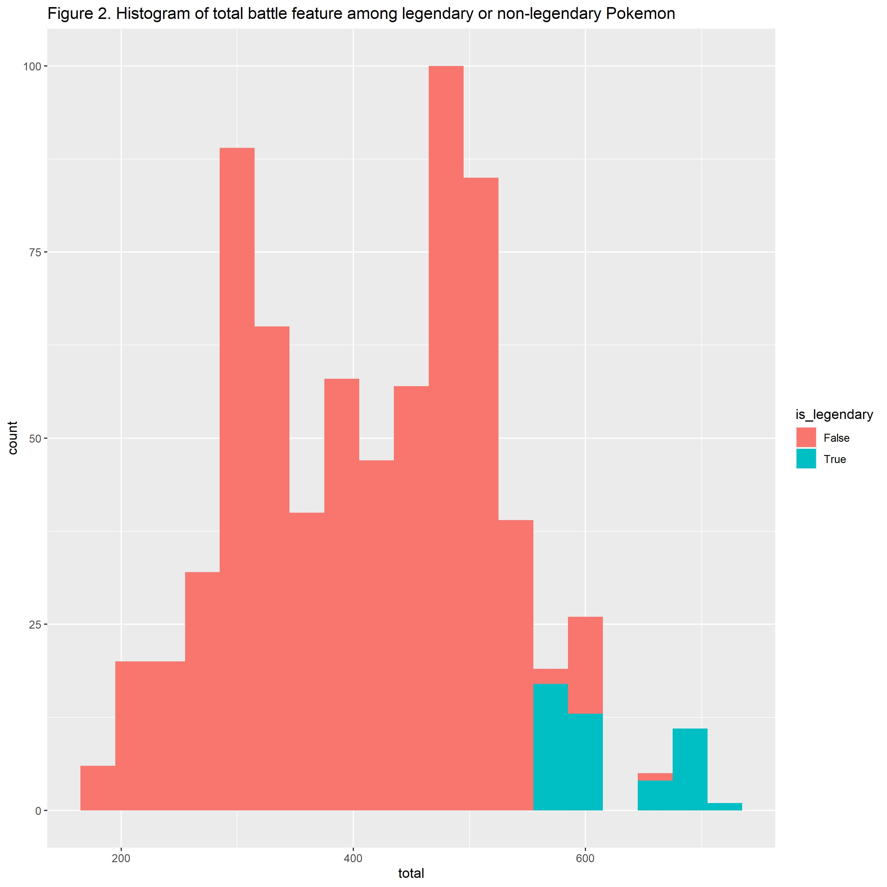
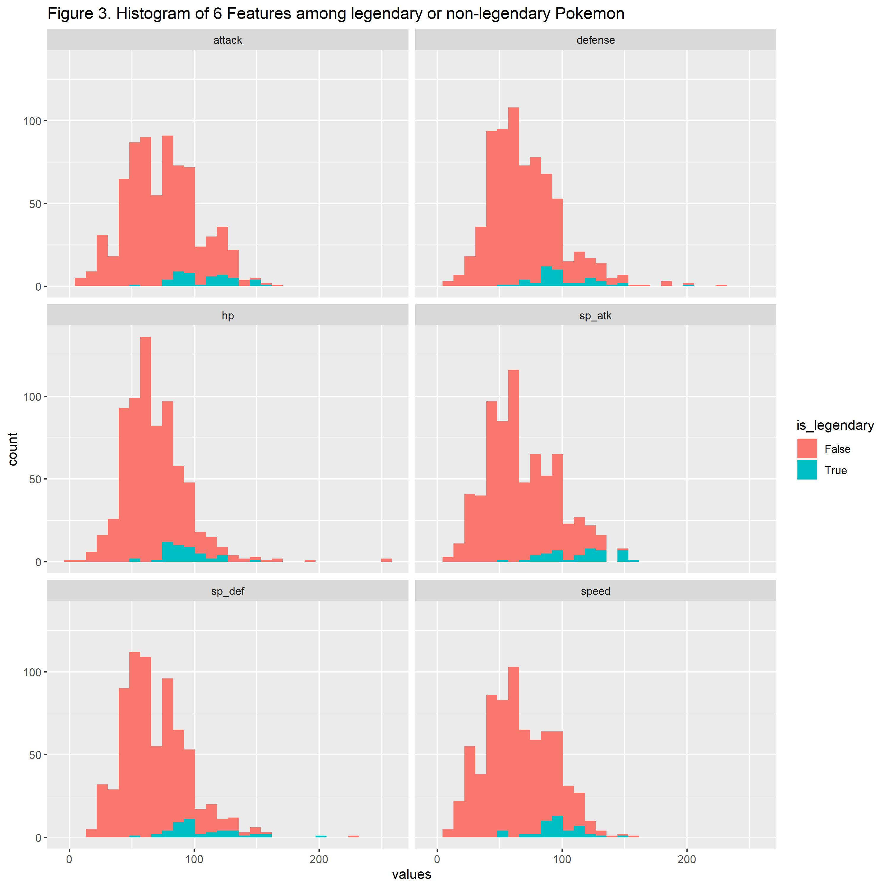
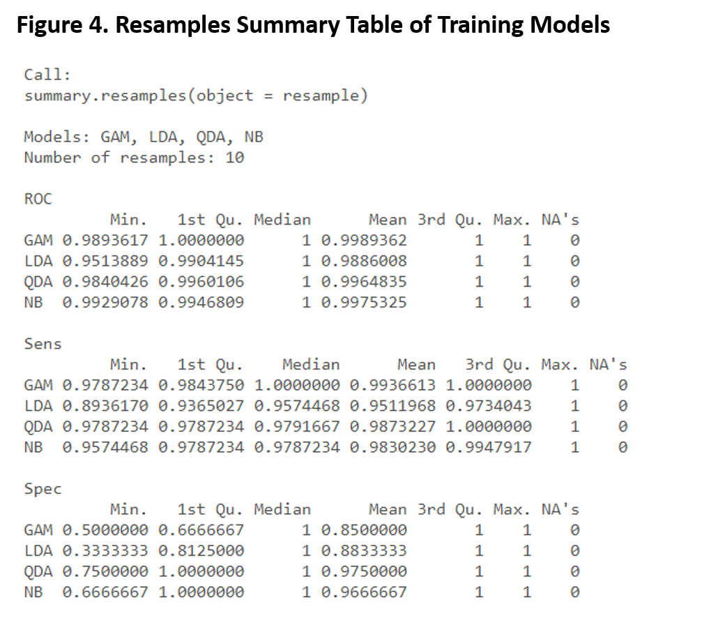
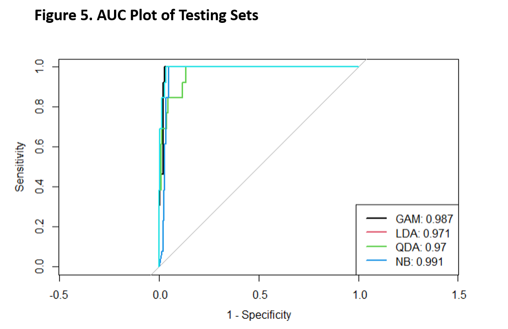

## Introduction

Pokemon are fictional creatures, which can be captured by players and trained to battle each other for sport games. The dataset I used for this project includes basic information of 721 unique Pokemon, such as their names, battle features (health point, attack value, defense value, attack speed, etc), types, egg group, color, height, and weight, etc. Legendary Pokemon are a group of incredibly rare and often powerful Pokemon, which is also included in this dataset. As every player dreams to have a legendary Pokemon, it also leads to the question I am interested in: **Can we use the basic information to predict whether the Pokemon would be legendary?** \
(Dataset Source: https://www.kaggle.com/alopez247/pokemon)

The dataset overall is tidy. I removed the variable "number", which just lists the numbers of Pokemon. By observation, I found that the variable "total" looks like the sum of "hp", "attack", "defense", "speed", "sp_atk", and "sp_def", and I calculated with all values in the columns and proved my assumption. However, we still need further visualization or analysis to determine whether we should keep the "total" or the six battle features specifically. During visualization coding, I found that there is one line with all it's values in wrong columns, and I removed it from the dataset. 

<br>
<br>
<br>

## Exploratory Analysis

I used contingency table (Figure 1) to show the overall relationship between legendary and non-legendary Pokemon. According to the table, I observed that legendary Pokemon have much higher mean and median than non-legendary ones in total battle features, health point, attack, defense, speed, attack speed, defense speed, proportion of not having gender, undiscovered egg groups, no mega evolution, height, weight, and low catch rate. While other variables do not have significant differences on mean, median, or proportions. 

I also used two histograms to show the distribution of legendary Pokemon in total battle features (Figure 2) and 6 specific battle features (Figure 3). From Figure 1, I observed that all of the legendary Pokemon have over 550 total battle features. From Figure 2, I observed that most legendary Pokemon have each of the battle features values greater than average, but they are not showing an absolute trend or line. Therefore, I decided to use total battle features for future modeling.  

\newpage

## Model

Based on the exploratory analysis, I decided to use the continuous and binary predictors that are significantly different between legendary and non-legendary Pokemon, which are: \
* ` is_legendary`: the response/outcome, whether the Pokemon is legendary or not (Yes/No). \
* ` total`: The sum of 6 battle features values. \
* ` has_gender`: whether the Pokemon has a gender (True/False). \
* ` has_mega_evolution`: whether the Pokemon has mega evolution (True/False).\
* ` height_m`: the height of Pokemon in Meters. \
* ` weight_kg`: the weight of Pokemon in Kilograms. \
* ` catch rate`: the officially set catch rate of each Pokemon (range from 0 ~ 255).\

As the response is a binary categorical variable, I used classification to build models, which are LDA, QDA, and Naive Bayes methods, and GAM from logistic regression. I assume all of the subjects are independent in each class. And for LDA method, I assume the subjects are normally distributed. I divided the dataset 70% to training set, and the left 30% to testing set.\ 

`resamples` function is used to compare the four training models, and to select a better one from summary table (Figure 4). In the ROC section, four models have high values, ranged from 0.99 ~ 1. Among the four models, GAM model gives the highest value, and we consider it performs better. 

` predict` and `roc` functions are used to test, evaluate, and compare the four testing sets, and to select a better one from the ROC and AUC plot (Figure 5). According to the graph and AUC values, four sets have high values, ranged from 0.97 ~ 0.99. Among the four sets, Naive Bayes set gives the highest value, and GAM set follows. 

<br>
<br>
<br>


## Conclusion

Based on the performance of training and testing, I would select GAM as the final model for future prediction. Although Naive Bayes set performs the best in testing, the result contradicts with the NB assumption; it is useful when p is very large, while the p of legendary is only about `r round(46/720, 2)`. So I would not consider it as the final model. *GAM model performs good in both training and testing, and I would consider it as the final model.* This result corresponds to my expectation that the final model would be GAM or QDA. LDA is better for K > 2, while  K = 2 in our dataset. And the reason not expecting Naive Bayes method is explained before. 

Because of my limited knowledge about machine learning, I removed some of the predictors (multi-level categorical variables) from the training and testing sets, which is one of the major limitation of this project. Better Approaches might exist if we have include all meaningful predictors. 

\newpage


## Appendix

All Codes are in the "yf2555_mtp.Rmd" file. 

**Figure 1. Contingency Table of Legendary and Non-legendary Pokemon**
```{r, echo=FALSE, warning=FALSE, message=FALSE}
library(tidyverse)
library(arsenal)

setwd("C:/Users/irene/OneDrive - cumc.columbia.edu/2021 M1 Spring/Data Science 2/HW/midterm")

pkmn.df = read.csv("./pokemon.csv") %>%
  janitor::clean_names() %>%
  dplyr::select(-number)
pkmn.df = pkmn.df[-32,]

my_controls <- tableby.control(
               total = TRUE,
               test = FALSE, 
               numeric.stats = c("meansd", "medianq1q3"),  
               cat.stats = c("countpct"),                            
               stats.labels = list(
               meansd = "Mean (SD)",
               medianq1q3 = "Median (Q1, Q3)",
               countpct = "N (%)"))

descriptive.table = tableby(is_legendary ~ type_1 + type_2 + total + hp + attack + defense + sp_atk + sp_def + speed + generation + color + has_gender + pr_male + egg_group_1 + egg_group_2 + has_mega_evolution + height_m + weight_kg + catch_rate + body_style,
                            data = pkmn.df,
                            control = my_controls)
summary(descriptive.table,
        digits = 1) %>%
  knitr::kable()
```


\newpage




\newpage









